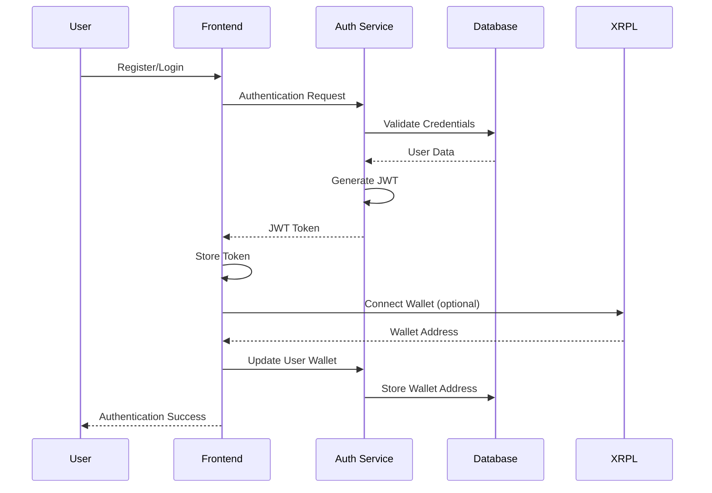
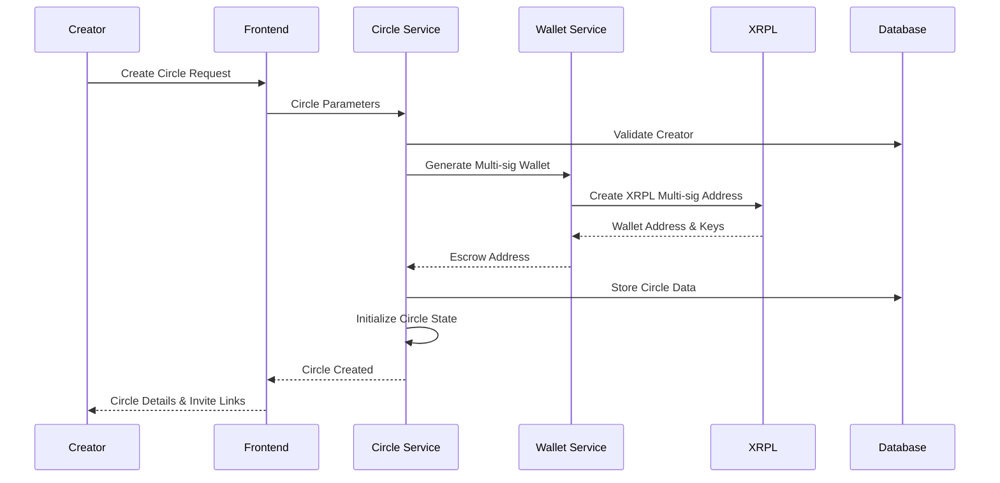
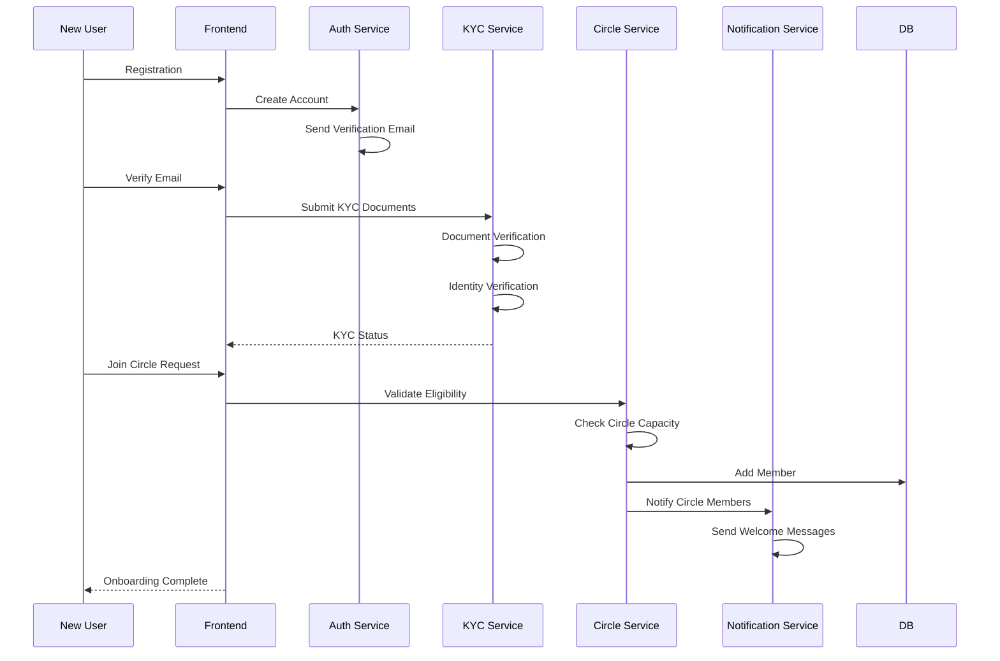
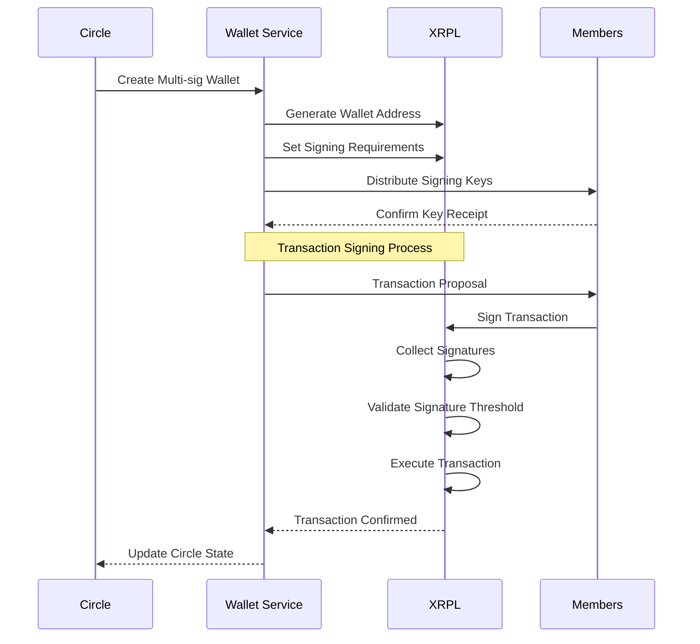
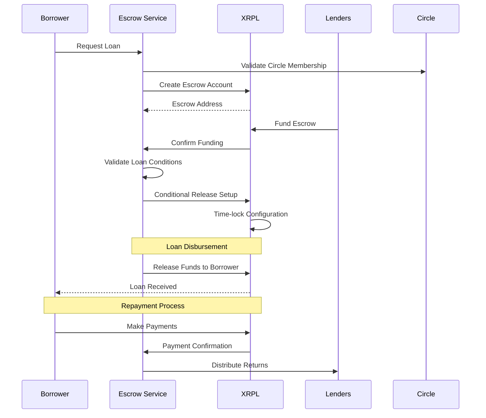
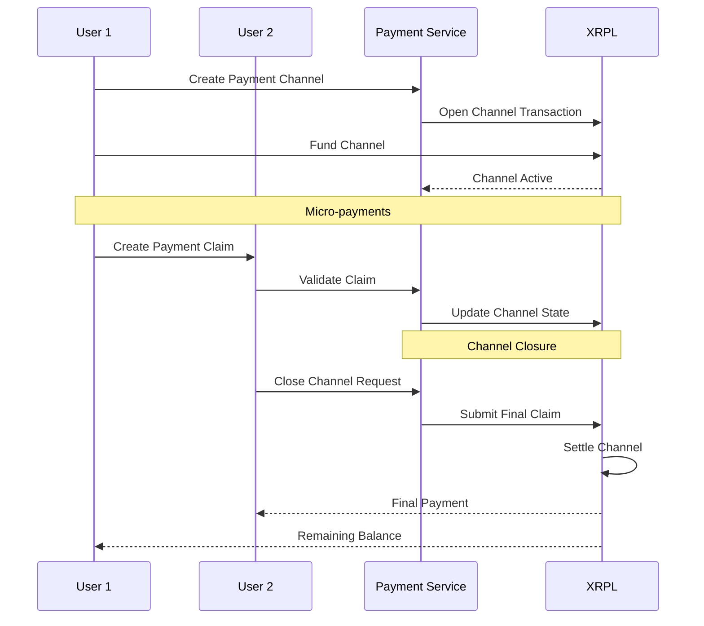

# LedgerLoop System Architecture

## Overview

LedgerLoop is a decentralized lending circle platform built on the XRP Ledger (XRPL) that enables community-based lending through rotating savings and credit associations (ROSCAs). The system combines traditional peer-to-peer lending concepts with blockchain technology to provide transparency, security, and automated escrow functionality.

## High-Level System Diagram

```
┌─────────────────────────────────────────────────────────────────┐
│                        LedgerLoop System                        │
├─────────────────────────────────────────────────────────────────┤
│  Frontend Layer (React)                                         │
│  ┌───────────────┐ ┌──────────────┐ ┌────────────────────────┐  │
│  │ User Dashboard│ │ Circle Mgmt  │ │ Transaction History    │  │
│  │               │ │              │ │                        │  │
│  │ - Profile     │ │ - Create     │ │ - Payment Tracking     │  │
│  │ - Wallet      │ │ - Join       │ │ - Loan Status          │  │
│  │ - Circles     │ │ - Settings   │ │ - Escrow Status        │  │
│  └───────────────┘ └──────────────┘ └────────────────────────┘  │
├─────────────────────────────────────────────────────────────────┤
│  API Gateway & Load Balancer                                   │
├─────────────────────────────────────────────────────────────────┤
│  Backend Services (Node.js)                                    │
│  ┌───────────────┐ ┌──────────────┐ ┌────────────────────────┐  │
│  │ Auth Service  │ │ Circle Svc   │ │ Payment Service        │  │
│  │               │ │              │ │                        │  │
│  │ - JWT         │ │ - Creation   │ │ - Escrow Management    │  │
│  │ - OAuth       │ │ - Management │ │ - Multi-sig Wallets    │  │
│  │ - 2FA         │ │ - Matching   │ │ - Payment Channels     │  │
│  └───────────────┘ └──────────────┘ └────────────────────────┘  │
│                                                                 │
│  ┌───────────────┐ ┌──────────────┐ ┌────────────────────────┐  │
│  │ User Service  │ │ Notification │ │ Grant Review Service   │  │
│  │               │ │ Service      │ │                        │  │
│  │ - Profiles    │ │ - Email      │ │ - Application Review   │  │
│  │ - KYC         │ │ - SMS        │ │ - Risk Assessment      │  │
│  │ - Onboarding  │ │ - Push       │ │ - Approval Workflows   │  │
│  └───────────────┘ └──────────────┘ └────────────────────────┘  │
├─────────────────────────────────────────────────────────────────┤
│  XRPL Integration Layer                                         │
│  ┌───────────────┐ ┌──────────────┐ ┌────────────────────────┐  │
│  │ Wallet Mgmt   │ │ Transaction  │ │ Smart Contract Layer   │  │
│  │               │ │ Handler      │ │                        │  │
│  │ - Address Gen │ │ - Payments   │ │ - Escrow Contracts     │  │
│  │ - Multi-sig   │ │ - Escrow     │ │ - Payment Channels     │  │
│  │ - Key Mgmt    │ │ - Channels   │ │ - Time-locked Txns     │  │
│  └───────────────┘ └──────────────┘ └────────────────────────┘  │
├─────────────────────────────────────────────────────────────────┤
│  Data Layer                                                     │
│  ┌───────────────┐ ┌──────────────┐ ┌────────────────────────┐  │
│  │ PostgreSQL    │ │ Redis Cache  │ │ IPFS Storage           │  │
│  │               │ │              │ │                        │  │
│  │ - User Data   │ │ - Sessions   │ │ - Documents            │  │
│  │ - Circles     │ │ - Temp Data  │ │ - KYC Files            │  │
│  │ - Transactions│ │ - Rate Limit │ │ - Legal Agreements     │  │
│  └───────────────┘ └──────────────┘ └────────────────────────┘  │
├─────────────────────────────────────────────────────────────────┤
│  External Integrations                                          │
│  ┌───────────────┐ ┌──────────────┐ ┌────────────────────────┐  │
│  │ XRPL Network  │ │ Email/SMS    │ │ KYC Provider           │  │
│  │               │ │ Services     │ │                        │  │
│  │ - Mainnet     │ │ - SendGrid   │ │ - Identity Verification│  │
│  │ - Testnet     │ │ - Twilio     │ │ - Document Validation  │  │
│  │ - Hooks       │ │              │ │ - Risk Scoring         │  │
│  └───────────────┘ └──────────────┘ └────────────────────────┘  │
└─────────────────────────────────────────────────────────────────┘
```

## System Components

### 1. Frontend Layer (React)

The React-based frontend provides a responsive, user-friendly interface for all LedgerLoop operations.

#### Key Components:
- **User Dashboard**: Personal profile, wallet management, circle participation overview
- **Circle Management**: Create new circles, join existing circles, configure circle parameters
- **Transaction Interface**: Payment scheduling, escrow monitoring, payment history
- **Member Onboarding**: Step-by-step registration and verification process
- **Admin Panel**: Grant application review interface for administrators

#### Technology Stack:
- React 18+ with TypeScript
- Redux Toolkit for state management
- Material-UI or Chakra UI for component library
- React Router for navigation
- React Query for API state management
- Web3 wallet integration (MetaMask, WalletConnect)

### 2. Backend Services (Node.js)

Microservices architecture built with Node.js providing scalable, maintainable business logic.

#### Core Services:

##### Authentication Service
- JWT-based authentication
- OAuth integration (Google, Facebook, GitHub)
- Two-factor authentication (2FA)
- Session management
- Role-based access control (RBAC)

##### User Service
- User profile management
- KYC/AML compliance
- Identity verification
- Credit scoring
- User preferences and settings

##### Circle Service
- Lending circle creation and management
- Member matching algorithms
- Circle parameter configuration
- Payment scheduling
- Circle lifecycle management

##### Payment Service
- XRPL transaction handling
- Multi-signature wallet management
- Escrow contract management
- Payment channel setup and management
- Transaction validation and settlement

##### Grant Review Service
- Application submission handling
- Automated risk assessment
- Review workflow management
- Approval/rejection processing
- Compliance checking

##### Notification Service
- Email notifications
- SMS alerts
- Push notifications
- Event-driven messaging
- Template management

### 3. XRPL Integration Layer

Custom integration layer for seamless interaction with the XRP Ledger.

#### Components:

##### Wallet Management
- XRPL address generation
- Multi-signature wallet creation
- Private key management (encrypted storage)
- Wallet backup and recovery
- Hardware wallet integration

##### Transaction Handler
- Payment processing
- Escrow transaction management
- Payment channel operations
- Transaction fee optimization
- Error handling and retry logic

##### Smart Contract Layer
- Escrow contract templates
- Time-locked transactions
- Conditional payments
- Multi-party signatures
- Contract state management

## Data Models

### User Model
```json
{
  "id": "uuid",
  "email": "string",
  "profile": {
    "firstName": "string",
    "lastName": "string",
    "dateOfBirth": "date",
    "phoneNumber": "string",
    "address": {
      "street": "string",
      "city": "string",
      "state": "string",
      "zipCode": "string",
      "country": "string"
    }
  },
  "xrplAddresses": ["string"],
  "kycStatus": "enum(pending, verified, rejected)",
  "creditScore": "number",
  "isActive": "boolean",
  "createdAt": "timestamp",
  "updatedAt": "timestamp"
}
```

### Circle Model
```json
{
  "id": "uuid",
  "name": "string",
  "description": "string",
  "creatorId": "uuid",
  "parameters": {
    "maxMembers": "number",
    "contributionAmount": "number",
    "currency": "string",
    "paymentFrequency": "enum(weekly, biweekly, monthly)",
    "duration": "number",
    "interestRate": "number"
  },
  "status": "enum(forming, active, completed, cancelled)",
  "members": [
    {
      "userId": "uuid",
      "joinedAt": "timestamp",
      "paymentOrder": "number",
      "status": "enum(active, defaulted, completed)"
    }
  ],
  "escrowAddress": "string",
  "multisigConfig": {
    "requiredSignatures": "number",
    "signers": ["string"]
  },
  "createdAt": "timestamp",
  "updatedAt": "timestamp"
}
```

### Loan Model
```json
{
  "id": "uuid",
  "circleId": "uuid",
  "borrowerId": "uuid",
  "amount": "number",
  "currency": "string",
  "interestRate": "number",
  "termMonths": "number",
  "status": "enum(pending, approved, active, completed, defaulted)",
  "paymentSchedule": [
    {
      "dueDate": "date",
      "amount": "number",
      "status": "enum(pending, paid, overdue)"
    }
  ],
  "escrowTransactionId": "string",
  "createdAt": "timestamp",
  "updatedAt": "timestamp"
}
```

### Transaction Model
```json
{
  "id": "uuid",
  "type": "enum(contribution, loan_disbursement, loan_payment, escrow_release)",
  "fromUserId": "uuid",
  "toUserId": "uuid",
  "circleId": "uuid",
  "amount": "number",
  "currency": "string",
  "xrplTransactionId": "string",
  "status": "enum(pending, confirmed, failed)",
  "metadata": "object",
  "createdAt": "timestamp",
  "confirmedAt": "timestamp"
}
```

## Database Schema

### PostgreSQL Tables

```sql
-- Users table
CREATE TABLE users (
    id UUID PRIMARY KEY DEFAULT gen_random_uuid(),
    email VARCHAR(255) UNIQUE NOT NULL,
    password_hash VARCHAR(255),
    profile JSONB NOT NULL,
    xrpl_addresses TEXT[],
    kyc_status VARCHAR(20) DEFAULT 'pending',
    credit_score INTEGER,
    is_active BOOLEAN DEFAULT true,
    created_at TIMESTAMP WITH TIME ZONE DEFAULT NOW(),
    updated_at TIMESTAMP WITH TIME ZONE DEFAULT NOW()
);

-- Circles table
CREATE TABLE circles (
    id UUID PRIMARY KEY DEFAULT gen_random_uuid(),
    name VARCHAR(255) NOT NULL,
    description TEXT,
    creator_id UUID REFERENCES users(id),
    parameters JSONB NOT NULL,
    status VARCHAR(20) DEFAULT 'forming',
    escrow_address VARCHAR(100),
    multisig_config JSONB,
    created_at TIMESTAMP WITH TIME ZONE DEFAULT NOW(),
    updated_at TIMESTAMP WITH TIME ZONE DEFAULT NOW()
);

-- Circle members table
CREATE TABLE circle_members (
    id UUID PRIMARY KEY DEFAULT gen_random_uuid(),
    circle_id UUID REFERENCES circles(id),
    user_id UUID REFERENCES users(id),
    joined_at TIMESTAMP WITH TIME ZONE DEFAULT NOW(),
    payment_order INTEGER,
    status VARCHAR(20) DEFAULT 'active',
    UNIQUE(circle_id, user_id)
);

-- Loans table
CREATE TABLE loans (
    id UUID PRIMARY KEY DEFAULT gen_random_uuid(),
    circle_id UUID REFERENCES circles(id),
    borrower_id UUID REFERENCES users(id),
    amount DECIMAL(18,8) NOT NULL,
    currency VARCHAR(10) NOT NULL,
    interest_rate DECIMAL(5,4),
    term_months INTEGER,
    status VARCHAR(20) DEFAULT 'pending',
    payment_schedule JSONB,
    escrow_transaction_id VARCHAR(100),
    created_at TIMESTAMP WITH TIME ZONE DEFAULT NOW(),
    updated_at TIMESTAMP WITH TIME ZONE DEFAULT NOW()
);

-- Transactions table
CREATE TABLE transactions (
    id UUID PRIMARY KEY DEFAULT gen_random_uuid(),
    type VARCHAR(30) NOT NULL,
    from_user_id UUID REFERENCES users(id),
    to_user_id UUID REFERENCES users(id),
    circle_id UUID REFERENCES circles(id),
    amount DECIMAL(18,8) NOT NULL,
    currency VARCHAR(10) NOT NULL,
    xrpl_transaction_id VARCHAR(100),
    status VARCHAR(20) DEFAULT 'pending',
    metadata JSONB,
    created_at TIMESTAMP WITH TIME ZONE DEFAULT NOW(),
    confirmed_at TIMESTAMP WITH TIME ZONE
);

-- Grant applications table
CREATE TABLE grant_applications (
    id UUID PRIMARY KEY DEFAULT gen_random_uuid(),
    applicant_id UUID REFERENCES users(id),
    circle_id UUID REFERENCES circles(id),
    requested_amount DECIMAL(18,8) NOT NULL,
    purpose TEXT NOT NULL,
    business_plan JSONB,
    status VARCHAR(20) DEFAULT 'pending',
    reviewer_id UUID REFERENCES users(id),
    review_notes TEXT,
    approved_amount DECIMAL(18,8),
    created_at TIMESTAMP WITH TIME ZONE DEFAULT NOW(),
    reviewed_at TIMESTAMP WITH TIME ZONE
);

-- Indexes for performance
CREATE INDEX idx_users_email ON users(email);
CREATE INDEX idx_users_kyc_status ON users(kyc_status);
CREATE INDEX idx_circles_status ON circles(status);
CREATE INDEX idx_circle_members_circle_id ON circle_members(circle_id);
CREATE INDEX idx_loans_borrower_id ON loans(borrower_id);
CREATE INDEX idx_loans_status ON loans(status);
CREATE INDEX idx_transactions_user_id ON transactions(from_user_id, to_user_id);
CREATE INDEX idx_transactions_circle_id ON transactions(circle_id);
CREATE INDEX idx_grant_applications_status ON grant_applications(status);
```

## API Endpoints

### Authentication Endpoints

```
POST   /api/auth/register         - User registration
POST   /api/auth/login            - User login
POST   /api/auth/logout           - User logout
POST   /api/auth/refresh          - Refresh JWT token
POST   /api/auth/forgot-password  - Password reset request
POST   /api/auth/reset-password   - Password reset confirmation
POST   /api/auth/verify-email     - Email verification
POST   /api/auth/enable-2fa       - Enable two-factor authentication
POST   /api/auth/verify-2fa       - Verify 2FA token
```

### User Management Endpoints

```
GET    /api/users/profile         - Get user profile
PUT    /api/users/profile         - Update user profile
POST   /api/users/kyc             - Submit KYC documents
GET    /api/users/kyc/status      - Get KYC verification status
POST   /api/users/wallet          - Add XRPL wallet address
DELETE /api/users/wallet/:address - Remove wallet address
GET    /api/users/credit-score    - Get credit score information
```

### Circle Management Endpoints

```
GET    /api/circles               - List available circles
POST   /api/circles               - Create new circle
GET    /api/circles/:id           - Get circle details
PUT    /api/circles/:id           - Update circle settings
DELETE /api/circles/:id           - Cancel circle
POST   /api/circles/:id/join      - Join a circle
POST   /api/circles/:id/leave     - Leave a circle
GET    /api/circles/:id/members   - Get circle members
POST   /api/circles/:id/invite    - Invite user to circle
```

### Loan Management Endpoints

```
GET    /api/loans                 - List user's loans
POST   /api/loans                 - Create loan request
GET    /api/loans/:id             - Get loan details
PUT    /api/loans/:id             - Update loan status
POST   /api/loans/:id/payment     - Make loan payment
GET    /api/loans/:id/schedule    - Get payment schedule
POST   /api/loans/:id/approve     - Approve loan (circle admin)
```

### Transaction Endpoints

```
GET    /api/transactions          - List user transactions
POST   /api/transactions/payment  - Initiate payment
GET    /api/transactions/:id      - Get transaction details
POST   /api/transactions/escrow   - Create escrow transaction
PUT    /api/transactions/escrow/:id/release - Release escrow funds
GET    /api/transactions/history  - Get transaction history
```

### Grant Application Endpoints

```
GET    /api/grants                - List grant applications
POST   /api/grants                - Submit grant application
GET    /api/grants/:id            - Get grant application details
PUT    /api/grants/:id            - Update grant application
POST   /api/grants/:id/review     - Submit grant review
GET    /api/grants/pending        - List pending applications (admin)
POST   /api/grants/:id/approve    - Approve grant application
POST   /api/grants/:id/reject     - Reject grant application
```

## Workflows

### User Authentication Flow



### Lending Circle Creation Workflow



### Member Onboarding Process



### Multi-Signature Wallet Management



### Escrow Transaction Flow



### Payment Channel Setup



## XRPL Address Management

### Address Generation Strategy

```javascript
// Hierarchical Deterministic (HD) Wallet Implementation
class XRPLAddressManager {
  constructor(masterSeed) {
    this.masterSeed = masterSeed;
    this.derivationPath = "m/44'/144'/0'/0/"; // XRP coin type
  }

  generateUserAddress(userId) {
    const path = `${this.derivationPath}${userId}`;
    const wallet = deriveWallet(this.masterSeed, path);
    return {
      address: wallet.classicAddress,
      publicKey: wallet.publicKey,
      privateKey: this.encryptPrivateKey(wallet.privateKey)
    };
  }

  generateMultiSigAddress(userAddresses, requiredSignatures) {
    const signerEntries = userAddresses.map(addr => ({
      account: addr,
      weight: 1
    }));

    return {
      signers: signerEntries,
      quorum: requiredSignatures,
      masterWeight: 0 // Disable master key
    };
  }

  encryptPrivateKey(privateKey) {
    // Use AES-256-GCM with user-specific salt
    return encrypt(privateKey, this.getEncryptionKey());
  }
}
```

### Multi-Signature Configuration

```javascript
// Multi-signature wallet setup for circles
async function setupCircleMultiSig(circleId, memberAddresses) {
  const requiredSignatures = Math.ceil(memberAddresses.length * 0.6); // 60% consensus
  
  const multisigConfig = {
    signerQuorum: requiredSignatures,
    signerEntries: memberAddresses.map(address => ({
      account: address,
      signerWeight: 1
    }))
  };

  const tx = {
    TransactionType: 'SignerListSet',
    Account: circleEscrowAddress,
    SignerQuorum: requiredSignatures,
    SignerEntries: multisigConfig.signerEntries
  };

  return await submitMultiSignedTransaction(tx, memberAddresses);
}
```

## Security Considerations

### Data Protection

1. **Encryption at Rest**
   - All sensitive data encrypted using AES-256-GCM
   - Separate encryption keys for different data types
   - Key rotation every 90 days

2. **Encryption in Transit**
   - TLS 1.3 for all API communications
   - Certificate pinning for mobile applications
   - End-to-end encryption for sensitive operations

3. **Private Key Management**
   - Hardware Security Module (HSM) integration
   - Multi-party computation for key generation
   - Secure key backup and recovery procedures

### Authentication & Authorization

1. **Multi-Factor Authentication**
   - TOTP (Time-based One-Time Password)
   - SMS-based verification
   - Hardware token support

2. **Role-Based Access Control**
   - Granular permission system
   - Principle of least privilege
   - Regular access reviews

3. **Session Management**
   - JWT with short expiration times
   - Refresh token rotation
   - Session invalidation on security events

### XRPL Security

1. **Transaction Validation**
   - Multi-signature requirements
   - Transaction amount limits
   - Time-based restrictions

2. **Escrow Protection**
   - Conditional escrow releases
   - Multi-party approval requirements
   - Automated timeout mechanisms

3. **Network Security**
   - Rate limiting on XRPL interactions
   - Transaction replay protection
   - Network partition tolerance

### Compliance & Privacy

1. **KYC/AML Compliance**
   - Identity verification workflows
   - Suspicious activity monitoring
   - Regulatory reporting capabilities

2. **Data Privacy**
   - GDPR compliance
   - Data minimization principles
   - Right to deletion implementation

3. **Audit Trails**
   - Comprehensive transaction logging
   - Immutable audit records
   - Regular security assessments

## Scalability Approach

### Grant Application Review System

The grant application review system is designed to handle high volumes of applications efficiently while maintaining security and fairness.

#### Architecture Components

1. **Application Processing Pipeline**
   ```
   Application Submission → Initial Validation → Risk Assessment → 
   Human Review Queue → Decision Making → Notification & Disbursement
   ```

2. **Automated Risk Assessment**
   - Machine learning models for creditworthiness
   - Automated document verification
   - Fraud detection algorithms
   - Historical performance analysis

3. **Review Workflow Management**
   - Priority-based queue system
   - Load balancing across reviewers
   - SLA monitoring and enforcement
   - Escalation procedures

#### Scalability Features

1. **Horizontal Scaling**
   - Microservices architecture allows independent scaling
   - Container orchestration with Kubernetes
   - Auto-scaling based on queue depth
   - Geographic distribution of review teams

2. **Performance Optimization**
   - Caching of frequently accessed data
   - Database read replicas for reporting
   - Asynchronous processing of non-critical tasks
   - CDN for document storage and retrieval

3. **Queue Management**
   ```javascript
   // Grant application processing queue
   class GrantApplicationQueue {
     constructor() {
       this.queues = {
         high: new PriorityQueue(),
         medium: new PriorityQueue(),
         low: new PriorityQueue()
       };
       this.processors = new Map();
     }

     async addApplication(application) {
       const priority = await this.calculatePriority(application);
       const queue = this.queues[priority];
       queue.enqueue(application);
       
       // Trigger processing if reviewers available
       this.tryAssignReviewer();
     }

     async calculatePriority(application) {
       const factors = {
         amount: application.requestedAmount,
         urgency: application.urgencyScore,
         riskLevel: await this.assessRisk(application),
         applicantHistory: await this.getApplicantHistory(application.applicantId)
       };
       
       return this.priorityAlgorithm(factors);
     }

     async assignReviewer(application) {
       const availableReviewers = await this.getAvailableReviewers();
       const bestReviewer = this.matchReviewerToApplication(
         application, 
         availableReviewers
       );
       
       return this.createReviewTask(application, bestReviewer);
     }
   }
   ```

4. **Load Balancing Strategy**
   - Round-robin assignment for standard applications
   - Expertise-based matching for complex cases
   - Workload monitoring and redistribution
   - Geographic load distribution

5. **Performance Metrics**
   - Average processing time per application
   - Queue depth monitoring
   - Reviewer efficiency metrics
   - System throughput measurements

#### Review Process Automation

1. **Automated Preliminary Screening**
   ```javascript
   async function preliminaryScreening(application) {
     const checks = {
       completeness: validateDocumentCompleteness(application),
       eligibility: checkEligibilityCriteria(application),
       duplication: detectDuplicateApplications(application),
       fraud: performFraudDetection(application)
     };

     const results = await Promise.all(Object.values(checks));
     return results.every(check => check.passed);
   }
   ```

2. **Machine Learning Integration**
   - Credit risk assessment models
   - Document authenticity verification
   - Behavioral pattern analysis
   - Predictive success modeling

3. **Decision Support System**
   - Risk scoring algorithms
   - Recommendation engines
   - Historical data analysis
   - Comparative application metrics

#### Monitoring and Analytics

1. **Real-time Monitoring**
   - Application processing metrics
   - Queue performance indicators
   - Reviewer workload tracking
   - System health monitoring

2. **Analytics Dashboard**
   - Processing time trends
   - Approval rate analysis
   - Risk distribution patterns
   - Performance benchmarking

3. **Alerting System**
   - Queue overflow warnings
   - Processing delay alerts
   - Anomaly detection notifications
   - Performance degradation alerts

## Technology Stack Summary

### Frontend
- **Framework**: React 18+ with TypeScript
- **State Management**: Redux Toolkit
- **UI Library**: Material-UI or Chakra UI
- **Routing**: React Router
- **API Client**: React Query
- **Wallet Integration**: XRPL.js, MetaMask

### Backend
- **Runtime**: Node.js 18+
- **Framework**: Express.js or Fastify
- **Language**: TypeScript
- **Authentication**: JWT, Passport.js
- **Validation**: Joi or Zod
- **Testing**: Jest, Supertest

### Database & Storage
- **Primary Database**: PostgreSQL 14+
- **Cache**: Redis 7+
- **File Storage**: IPFS or AWS S3
- **Search**: Elasticsearch (optional)

### XRPL Integration
- **Library**: XRPL.js
- **Network**: XRPL Mainnet/Testnet
- **Wallet**: Hardware wallet support
- **Hooks**: XRPL Hooks for smart contracts

### Infrastructure
- **Containerization**: Docker
- **Orchestration**: Kubernetes
- **CI/CD**: GitHub Actions
- **Monitoring**: Prometheus, Grafana
- **Logging**: ELK Stack

### Security
- **TLS**: TLS 1.3
- **Secrets Management**: HashiCorp Vault
- **Key Management**: HSM integration
- **Scanning**: SAST/DAST tools

## Deployment Architecture

### Environment Strategy
- **Development**: Local Docker Compose
- **Staging**: Kubernetes cluster (AWS EKS)
- **Production**: Multi-region Kubernetes (AWS EKS)

### CI/CD Pipeline
1. Code commit triggers GitHub Actions
2. Automated testing (unit, integration, e2e)
3. Security scanning (SAST/DAST)
4. Container image building
5. Deployment to staging
6. Automated testing in staging
7. Manual approval for production
8. Blue-green deployment to production

### Monitoring & Observability
- **Metrics**: Prometheus + Grafana
- **Logging**: ELK Stack (Elasticsearch, Logstash, Kibana)
- **Tracing**: Jaeger or Zipkin
- **Alerting**: PagerDuty integration
- **Health Checks**: Kubernetes readiness/liveness probes

This comprehensive architecture document provides the foundation for building a secure, scalable, and user-friendly lending circle platform on the XRP Ledger. The modular design allows for iterative development and easy integration of additional features as the platform grows.