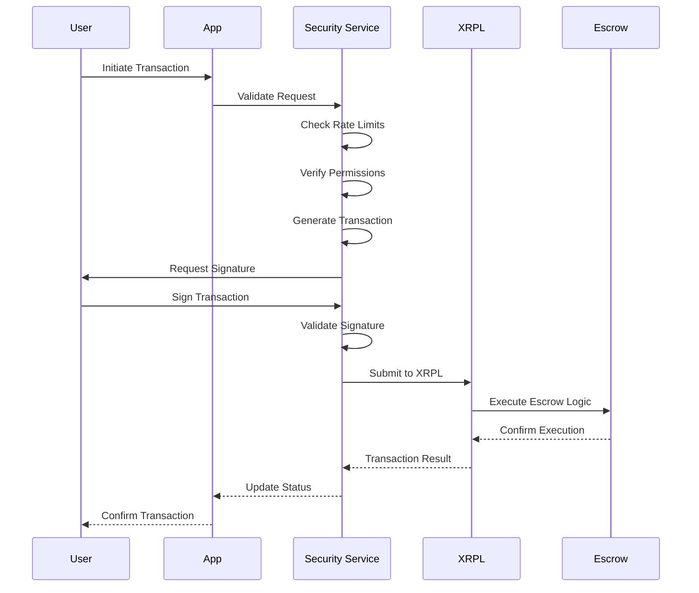
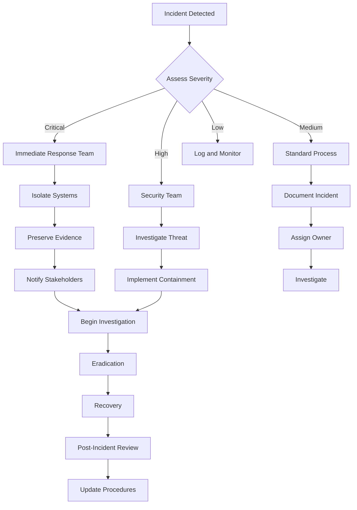

# LedgerLoop Security Documentation

## Overview

This document outlines the comprehensive security measures implemented in the LedgerLoop system to protect user data, financial transactions, and maintain compliance with regulatory requirements.

## Security Architecture

### Defense in Depth Strategy

```
┌─────────────────────────────────────────────────────────────────┐
│                     Security Layers                             │
├─────────────────────────────────────────────────────────────────┤
│ Layer 7: Application Security                                   │
│ ┌─────────────────┐ ┌─────────────────┐ ┌─────────────────────┐ │
│ │ Input Validation│ │ Business Logic  │ │ Output Encoding     │ │
│ │ - SQL Injection │ │ Security        │ │ - XSS Prevention    │ │
│ │ - XSS Prevention│ │ - Authorization │ │ - Data Sanitization │ │
│ │ - CSRF Guards   │ │ - Rate Limiting │ │ - Content Security  │ │
│ └─────────────────┘ └─────────────────┘ └─────────────────────┘ │
├─────────────────────────────────────────────────────────────────┤
│ Layer 6: API Security                                           │
│ ┌─────────────────┐ ┌─────────────────┐ ┌─────────────────────┐ │
│ │ Authentication  │ │ Authorization   │ │ API Gateway         │ │
│ │ - JWT Tokens    │ │ - RBAC          │ │ - Rate Limiting     │ │
│ │ - OAuth 2.0     │ │ - Permissions   │ │ - Request Validation│ │
│ │ - MFA           │ │ - Scope Control │ │ - Response Filtering│ │
│ └─────────────────┘ └─────────────────┘ └─────────────────────┘ │
├─────────────────────────────────────────────────────────────────┤
│ Layer 5: Transport Security                                     │
│ ┌─────────────────┐ ┌─────────────────┐ ┌─────────────────────┐ │
│ │ TLS 1.3         │ │ Certificate     │ │ HSTS                │ │
│ │ - Encryption    │ │ Management      │ │ - Strict Transport  │ │
│ │ - Perfect FS    │ │ - Auto Renewal  │ │ - Preload Lists     │ │
│ │ - Strong Ciphers│ │ - OCSP Stapling │ │ - Certificate Pin   │ │
│ └─────────────────┘ └─────────────────┘ └─────────────────────┘ │
├─────────────────────────────────────────────────────────────────┤
│ Layer 4: Network Security                                       │
│ ┌─────────────────┐ ┌─────────────────┐ ┌─────────────────────┐ │
│ │ Firewalls       │ │ Load Balancers  │ │ DDoS Protection     │ │
│ │ - WAF Rules     │ │ - Health Checks │ │ - Traffic Analysis  │ │
│ │ - IP Filtering  │ │ - SSL Termination│ │ - Rate Limiting     │ │
│ │ - Port Control  │ │ - Geo-blocking  │ │ - Anomaly Detection │ │
│ └─────────────────┘ └─────────────────┘ └─────────────────────┘ │
├─────────────────────────────────────────────────────────────────┤
│ Layer 3: Infrastructure Security                                │
│ ┌─────────────────┐ ┌─────────────────┐ ┌─────────────────────┐ │
│ │ Container       │ │ Kubernetes      │ │ Service Mesh        │ │
│ │ Security        │ │ Security        │ │ - mTLS              │ │
│ │ - Image Scanning│ │ - RBAC          │ │ - Traffic Policies  │ │
│ │ - Runtime       │ │ - Pod Security  │ │ - Zero Trust        │ │
│ │ - Secrets Mgmt  │ │ - Network Policies│ │ - Service Identity  │ │
│ └─────────────────┘ └─────────────────┘ └─────────────────────┘ │
├─────────────────────────────────────────────────────────────────┤
│ Layer 2: Data Security                                          │
│ ┌─────────────────┐ ┌─────────────────┐ ┌─────────────────────┐ │
│ │ Encryption      │ │ Key Management  │ │ Database Security   │ │
│ │ - At Rest       │ │ - HSM           │ │ - Access Control    │ │
│ │ - In Transit    │ │ - Key Rotation  │ │ - Audit Logging     │ │
│ │ - In Processing │ │ - Secure Backup │ │ - Query Monitoring  │ │
│ └─────────────────┘ └─────────────────┘ └─────────────────────┘ │
├─────────────────────────────────────────────────────────────────┤
│ Layer 1: Physical Security                                      │
│ ┌─────────────────┐ ┌─────────────────┐ ┌─────────────────────┐ │
│ │ Data Centers    │ │ Hardware        │ │ Environmental       │ │
│ │ - Access Control│ │ Security        │ │ Controls            │ │
│ │ - Biometric     │ │ - TPM/HSM       │ │ - Climate Control   │ │
│ │ - Surveillance  │ │ - Secure Boot   │ │ - Power Management  │ │
│ └─────────────────┘ └─────────────────┘ └─────────────────────┘ │
└─────────────────────────────────────────────────────────────────┘
```

## Authentication & Authorization

### Multi-Factor Authentication (MFA)

#### Supported Methods
1. **Time-based One-Time Password (TOTP)**
   - Compatible with Google Authenticator, Authy
   - 30-second time window
   - 6-digit codes

2. **SMS-based Verification**
   - Fallback method for TOTP
   - Rate-limited to prevent abuse
   - Geographic restrictions

3. **Hardware Tokens**
   - FIDO2/WebAuthn support
   - YubiKey compatibility
   - Biometric authentication

#### Implementation

```javascript
// MFA Setup Process
class MFAService {
  async enableTOTP(userId) {
    const secret = generateTOTPSecret();
    const qrCode = generateQRCode(secret, userId);
    
    // Store temporary secret
    await redis.setex(`mfa:setup:${userId}`, 300, secret);
    
    return {
      secret,
      qrCode,
      backupCodes: generateBackupCodes()
    };
  }

  async verifyTOTP(userId, token) {
    const secret = await this.getUserTOTPSecret(userId);
    const isValid = verifyTOTPToken(secret, token);
    
    if (!isValid) {
      await this.incrementFailedAttempts(userId);
      throw new Error('Invalid TOTP token');
    }
    
    await this.resetFailedAttempts(userId);
    return true;
  }

  async generateBackupCodes(userId) {
    const codes = Array.from({ length: 10 }, () => 
      generateSecureCode(8)
    );
    
    const hashedCodes = codes.map(code => bcrypt.hash(code, 12));
    await this.storeBackupCodes(userId, hashedCodes);
    
    return codes;
  }
}
```

### Role-Based Access Control (RBAC)

#### Role Hierarchy

```
Admin (Full System Access)
├── Grant Reviewer (Application Review)
│   ├── Senior Reviewer (High-value applications)
│   └── Junior Reviewer (Standard applications)
├── Circle Administrator (Circle Management)
│   ├── Circle Creator (Create/Manage Own Circles)
│   └── Circle Member (Participate in Circles)
└── Standard User (Basic Platform Access)
    ├── Verified User (KYC Completed)
    └── Unverified User (Limited Access)
```

#### Permission Matrix

| Resource | Admin | Grant Reviewer | Circle Admin | Circle Creator | Circle Member | Standard User |
|----------|-------|----------------|--------------|----------------|---------------|---------------|
| User Management | CRUD | R | R | R | R | R (own) |
| Circle Management | CRUD | R | CRUD | CRU (own) | RU (member) | R |
| Loan Processing | CRUD | RU | RU | RU | RU (member) | R (own) |
| Grant Review | CRUD | RU | R | R | R | R (own) |
| System Config | CRUD | - | - | - | - | - |
| Financial Reports | R | R | R (own circles) | R (own) | R (own) | R (own) |

### JWT Token Management

#### Token Structure

```json
{
  "header": {
    "alg": "RS256",
    "typ": "JWT",
    "kid": "key-id"
  },
  "payload": {
    "sub": "user-id",
    "iss": "ledgerloop.com",
    "aud": "ledgerloop-api",
    "exp": 1234567890,
    "iat": 1234567890,
    "jti": "token-id",
    "email": "user@example.com",
    "role": "user",
    "permissions": ["circle:read", "transaction:create"],
    "mfa_verified": true,
    "kyc_status": "verified"
  },
  "signature": "..."
}
```

#### Token Security Features

1. **Short Expiration Times**
   - Access tokens: 15 minutes
   - Refresh tokens: 7 days
   - Admin tokens: 5 minutes

2. **Token Rotation**
   - Automatic rotation on refresh
   - Invalidation of old tokens
   - Suspicious activity detection

3. **Secure Storage**
   - httpOnly cookies for web
   - Secure storage for mobile
   - No localStorage usage

## Cryptographic Security

### Encryption Standards

#### Data at Rest
- **Algorithm**: AES-256-GCM
- **Key Management**: AWS KMS / HashiCorp Vault
- **Key Rotation**: Every 90 days
- **Backup Encryption**: Separate key hierarchy

#### Data in Transit
- **Protocol**: TLS 1.3
- **Cipher Suites**: ChaCha20-Poly1305, AES-256-GCM
- **Certificate**: ECDSA P-384
- **HPKP**: Certificate pinning enabled

#### XRPL Cryptography
- **Signing Algorithm**: ECDSA secp256k1
- **Hash Function**: SHA-256
- **Key Derivation**: BIP32 HD wallets
- **Entropy**: Hardware RNG + additional entropy

### Key Management Architecture

```javascript
// Hierarchical Key Management
class KeyManagementService {
  constructor() {
    this.masterKey = this.loadFromHSM();
    this.keyHierarchy = {
      master: this.masterKey,
      dataEncryption: this.deriveKey('data-encryption'),
      userWallets: this.deriveKey('user-wallets'),
      escrowWallets: this.deriveKey('escrow-wallets'),
      apiSigning: this.deriveKey('api-signing')
    };
  }

  async encryptUserData(userId, data) {
    const userKey = this.deriveUserKey(userId);
    const nonce = generateNonce();
    const encrypted = aes256gcm.encrypt(data, userKey, nonce);
    
    return {
      encrypted,
      nonce,
      keyVersion: this.getCurrentKeyVersion()
    };
  }

  async generateXRPLWallet(userId) {
    const seed = this.deriveXRPLSeed(userId);
    const wallet = xrpl.Wallet.fromSeed(seed);
    
    // Store encrypted private key
    const encryptedKey = await this.encryptPrivateKey(
      wallet.privateKey,
      userId
    );
    
    return {
      address: wallet.classicAddress,
      publicKey: wallet.publicKey,
      encryptedPrivateKey: encryptedKey
    };
  }
}
```

## XRPL Security

### Multi-Signature Implementation

#### Escrow Wallet Configuration

```javascript
// Multi-signature escrow wallet setup
class EscrowWalletManager {
  async createCircleEscrow(circleId, memberAddresses) {
    const requiredSignatures = Math.ceil(memberAddresses.length * 0.6);
    
    // Create multi-sig configuration
    const signerListTx = {
      TransactionType: 'SignerListSet',
      Account: escrowAddress,
      SignerQuorum: requiredSignatures,
      SignerEntries: memberAddresses.map(addr => ({
        SignerEntry: {
          Account: addr,
          SignerWeight: 1
        }
      }))
    };

    // Disable master key for security
    const masterKeyTx = {
      TransactionType: 'AccountSet',
      Account: escrowAddress,
      SetFlag: 4 // asfDisableMaster
    };

    return await this.submitMultiSignedTransaction([
      signerListTx,
      masterKeyTx
    ]);
  }

  async createConditionalEscrow(params) {
    const escrowTx = {
      TransactionType: 'EscrowCreate',
      Account: params.source,
      Destination: params.destination,
      Amount: params.amount,
      FinishAfter: params.unlockTime,
      Condition: params.condition, // Crypto-condition
      DestinationTag: params.tag
    };

    return await this.submitTransaction(escrowTx);
  }
}
```

### Transaction Security

#### Secure Transaction Flow



#### Anti-Fraud Measures

```javascript
// Transaction monitoring and fraud detection
class FraudDetectionService {
  async analyzeTransaction(transaction) {
    const riskScore = await this.calculateRiskScore(transaction);
    const anomalies = await this.detectAnomalies(transaction);
    
    if (riskScore > 0.8 || anomalies.length > 0) {
      await this.flagForReview(transaction, {
        riskScore,
        anomalies,
        recommendation: 'HOLD'
      });
      return false;
    }
    
    return true;
  }

  async calculateRiskScore(transaction) {
    const factors = {
      amountRisk: this.assessAmountRisk(transaction.amount),
      velocityRisk: await this.assessVelocityRisk(transaction.userId),
      geographicRisk: await this.assessGeographicRisk(transaction.ipAddress),
      behaviorRisk: await this.assessBehaviorRisk(transaction.userId),
      networkRisk: await this.assessNetworkRisk(transaction.destination)
    };

    return this.weightedRiskScore(factors);
  }

  async detectAnomalies(transaction) {
    const userPattern = await this.getUserTransactionPattern(transaction.userId);
    const anomalies = [];

    // Check for unusual amounts
    if (transaction.amount > userPattern.maxAmount * 10) {
      anomalies.push('UNUSUAL_AMOUNT');
    }

    // Check for unusual timing
    if (this.isUnusualTiming(transaction.timestamp, userPattern.schedule)) {
      anomalies.push('UNUSUAL_TIMING');
    }

    // Check for new destinations
    if (!userPattern.knownDestinations.includes(transaction.destination)) {
      anomalies.push('NEW_DESTINATION');
    }

    return anomalies;
  }
}
```

## Data Protection & Privacy

### Personal Data Handling

#### Data Classification

| Level | Type | Examples | Protection |
|-------|------|----------|------------|
| Public | Non-sensitive | Circle names, public profiles | Standard encryption |
| Internal | Business | Transaction metadata, circle stats | Enhanced encryption |
| Confidential | Personal | PII, KYC documents | Multi-layer encryption |
| Restricted | Financial | Private keys, payment details | HSM + segregation |

#### GDPR Compliance

```javascript
// Personal data management for GDPR compliance
class PersonalDataManager {
  async handleDataSubjectRequest(userId, requestType) {
    switch (requestType) {
      case 'ACCESS':
        return await this.exportUserData(userId);
      
      case 'RECTIFICATION':
        return await this.enableDataCorrection(userId);
      
      case 'ERASURE':
        return await this.initiateDataDeletion(userId);
      
      case 'PORTABILITY':
        return await this.exportPortableData(userId);
      
      case 'RESTRICTION':
        return await this.restrictDataProcessing(userId);
    }
  }

  async exportUserData(userId) {
    const userData = {
      profile: await this.getUserProfile(userId),
      circles: await this.getUserCircles(userId),
      transactions: await this.getUserTransactions(userId),
      documents: await this.getUserDocuments(userId),
      preferences: await this.getUserPreferences(userId)
    };

    // Anonymize sensitive fields
    return this.anonymizeSensitiveData(userData);
  }

  async initiateDataDeletion(userId) {
    // Check for legal holds
    const legalHolds = await this.checkLegalHolds(userId);
    if (legalHolds.length > 0) {
      throw new Error('Cannot delete data due to legal holds');
    }

    // Check for active financial obligations
    const activeLoans = await this.getActiveLoans(userId);
    if (activeLoans.length > 0) {
      throw new Error('Cannot delete data with active loans');
    }

    // Schedule deletion
    await this.scheduleDataDeletion(userId, {
      delay: 30, // 30-day grace period
      notification: true
    });
  }
}
```

### Data Retention Policies

#### Retention Schedule

| Data Type | Retention Period | Reason |
|-----------|------------------|---------|
| User profiles | 7 years post-account closure | Regulatory compliance |
| Transaction records | 10 years | Financial regulations |
| KYC documents | 5 years post-verification | AML requirements |
| Audit logs | 7 years | Security compliance |
| Session data | 30 days | Performance optimization |
| Temporary files | 24 hours | Security best practice |

## Incident Response

### Security Incident Classification

#### Severity Levels

**Critical (P0)**
- Data breach affecting PII or financial data
- Unauthorized access to production systems
- Ransomware or similar attacks
- Complete service outage

**High (P1)**
- Unauthorized access attempts
- Suspected insider threats
- Partial service degradation
- Failed security controls

**Medium (P2)**
- Policy violations
- Suspicious user activity
- Non-critical vulnerabilities
- Configuration issues

**Low (P3)**
- Security awareness violations
- Minor policy exceptions
- Informational security events

### Incident Response Workflow



### Automated Response System

```javascript
// Automated incident response
class IncidentResponseSystem {
  async handleSecurityEvent(event) {
    const severity = await this.classifyEvent(event);
    const response = await this.generateResponse(event, severity);
    
    // Immediate automated actions
    if (severity >= 'HIGH') {
      await this.immediateResponse(event);
    }
    
    // Notify security team
    await this.notifySecurityTeam(event, severity);
    
    // Log for investigation
    await this.logIncident(event, response);
    
    return response;
  }

  async immediateResponse(event) {
    switch (event.type) {
      case 'MULTIPLE_FAILED_LOGINS':
        await this.temporaryAccountLock(event.userId);
        break;
        
      case 'SUSPICIOUS_TRANSACTION':
        await this.holdTransaction(event.transactionId);
        break;
        
      case 'MALICIOUS_IP':
        await this.blockIPAddress(event.sourceIP);
        break;
        
      case 'DATA_EXFILTRATION':
        await this.isolateAccount(event.userId);
        await this.revokeAllTokens(event.userId);
        break;
    }
  }

  async generateResponse(event, severity) {
    const playbook = await this.getResponsePlaybook(event.type);
    const customActions = await this.analyzeEventContext(event);
    
    return {
      immediateActions: playbook.immediate,
      investigationSteps: playbook.investigation,
      customActions,
      estimatedResolutionTime: this.calculateETA(severity),
      assignedTeam: this.assignTeam(severity)
    };
  }
}
```

## Compliance & Auditing

### Regulatory Compliance

#### Financial Regulations

**Anti-Money Laundering (AML)**
- Customer Due Diligence (CDD)
- Enhanced Due Diligence (EDD) for high-risk customers
- Suspicious Activity Reporting (SAR)
- Transaction monitoring and screening

**Know Your Customer (KYC)**
- Identity verification requirements
- Document authentication
- Ongoing monitoring
- Risk-based approach

#### Implementation

```javascript
// Compliance monitoring system
class ComplianceMonitor {
  async performKYCVerification(userId, documents) {
    const verification = {
      identity: await this.verifyIdentityDocument(documents.id),
      address: await this.verifyAddressDocument(documents.address),
      sanctions: await this.checkSanctionLists(documents.id.name),
      pep: await this.checkPEPLists(documents.id.name),
      creditCheck: await this.performCreditCheck(userId)
    };

    const riskScore = this.calculateKYCRiskScore(verification);
    const status = this.determineKYCStatus(riskScore);

    await this.updateKYCStatus(userId, status, verification);
    
    if (status === 'REJECTED' || riskScore > 0.8) {
      await this.flagForManualReview(userId, verification);
    }

    return { status, riskScore, verification };
  }

  async monitorTransactions(userId) {
    const transactions = await this.getRecentTransactions(userId);
    const patterns = await this.analyzeTransactionPatterns(transactions);
    
    const alerts = [];
    
    // Check for structuring
    if (patterns.structuring.score > 0.7) {
      alerts.push({
        type: 'STRUCTURING',
        severity: 'HIGH',
        details: patterns.structuring
      });
    }
    
    // Check for unusual activity
    if (patterns.velocity.abnormal) {
      alerts.push({
        type: 'UNUSUAL_VELOCITY',
        severity: 'MEDIUM',
        details: patterns.velocity
      });
    }
    
    // Check for geographic anomalies
    if (patterns.geographic.suspicious) {
      alerts.push({
        type: 'GEOGRAPHIC_ANOMALY',
        severity: 'MEDIUM',
        details: patterns.geographic
      });
    }
    
    if (alerts.length > 0) {
      await this.generateSAR(userId, alerts);
    }
    
    return alerts;
  }
}
```

### Audit Logging

#### Comprehensive Audit Trail

```javascript
// Audit logging system
class AuditLogger {
  async logSecurityEvent(event) {
    const auditEntry = {
      timestamp: new Date().toISOString(),
      eventId: generateUUID(),
      eventType: event.type,
      severity: event.severity,
      source: {
        userId: event.userId,
        ipAddress: event.ipAddress,
        userAgent: event.userAgent,
        sessionId: event.sessionId
      },
      target: {
        resource: event.resource,
        resourceId: event.resourceId,
        action: event.action
      },
      outcome: event.outcome,
      details: event.details,
      riskScore: event.riskScore
    };

    // Immediate logging to multiple destinations
    await Promise.all([
      this.writeToSecureLog(auditEntry),
      this.writeToSIEM(auditEntry),
      this.writeToBlockchain(auditEntry) // Immutable audit trail
    ]);

    // Real-time alerting for high-severity events
    if (event.severity >= 'HIGH') {
      await this.triggerAlert(auditEntry);
    }
  }

  async writeToBlockchain(auditEntry) {
    // Store hash of audit entry on blockchain for immutability
    const hash = this.calculateHash(auditEntry);
    const merkleRoot = await this.addToMerkleTree(hash);
    
    // Store on XRPL as memo
    await this.storeAuditHash(merkleRoot);
  }
}
```

#### Audit Event Categories

| Category | Events | Retention |
|----------|--------|-----------|
| Authentication | Login, logout, password changes, MFA | 7 years |
| Authorization | Permission changes, role assignments | 7 years |
| Data Access | View, create, update, delete operations | 5 years |
| Financial | Transactions, payments, escrow operations | 10 years |
| Administrative | System configuration, user management | 7 years |
| Security | Failed attempts, anomalies, incidents | 10 years |

## Security Testing & Validation

### Continuous Security Testing

#### Automated Security Scanning

```yaml
# Security scanning pipeline
security_scan:
  stages:
    - static_analysis:
        tools:
          - sonarqube
          - eslint-security
          - bandit
        thresholds:
          critical: 0
          high: 5
          medium: 20
    
    - dependency_scan:
        tools:
          - npm_audit
          - snyk
          - dependabot
        auto_fix: true
    
    - container_scan:
        tools:
          - trivy
          - clair
        registries:
          - docker_hub
          - private_registry
    
    - dynamic_analysis:
        tools:
          - owasp_zap
          - burp_suite
        environments:
          - staging
          - pre_production
```

#### Penetration Testing Schedule

| Type | Frequency | Scope |
|------|-----------|-------|
| External | Quarterly | Public-facing systems |
| Internal | Bi-annually | Internal network |
| Web Application | Monthly | All web interfaces |
| API | Bi-monthly | All API endpoints |
| Mobile | Quarterly | Mobile applications |
| Social Engineering | Annually | Employee awareness |

### Security Metrics & KPIs

#### Key Security Indicators

```javascript
// Security metrics dashboard
class SecurityMetrics {
  async generateSecurityReport() {
    return {
      authentication: {
        successRate: await this.getAuthSuccessRate(),
        mfaAdoption: await this.getMFAAdoptionRate(),
        passwordStrength: await this.getPasswordStrengthMetrics()
      },
      
      incidents: {
        totalIncidents: await this.getIncidentCount(),
        averageResolutionTime: await this.getAverageResolutionTime(),
        incidentsByCategory: await this.getIncidentsByCategory()
      },
      
      vulnerabilities: {
        openVulnerabilities: await this.getOpenVulnerabilities(),
        timeToPatch: await this.getAverageTimeToPatch(),
        riskDistribution: await this.getRiskDistribution()
      },
      
      compliance: {
        kycCompletionRate: await this.getKYCCompletionRate(),
        auditCoverage: await this.getAuditCoverage(),
        complianceScore: await this.getComplianceScore()
      }
    };
  }
}
```

This comprehensive security documentation provides the framework for implementing robust security measures across all aspects of the LedgerLoop platform, ensuring user trust and regulatory compliance.